# Riffly

**Riffly** is an all-in-one web app for guitar and bass players: a chromatic tuner, a string-by-string manual tuner, a fully configurable metronome, and a searchable library of chord sheets — all in one place, so you don't need four different apps.

## Features

- **Chromatic tuner** — listens through the microphone and shows the closest note in real time, with a needle that points left/right to tell you whether to tighten or loosen the string.
- **Manual tuner** — pick a tuning (multiple presets for guitar and bass) and get guided, string-by-string feedback instead of guessing.
- **Metronome** — configurable BPM (40–220, default 60), beat subdivision, and a count-in before the loop restarts.
- **Chord sheets** — each song has a chord sheet image, an embedded YouTube player, and one-tap shortcuts: jump to the metronome with the song's BPM already set, or to the manual tuner with the song's tuning pre-selected.
- **Song recognition** — listen through the microphone and identify what's currently playing via ACRCloud, then jump straight to its YouTube video, Spotify link, and (if it's already in the library) its chord sheet.
- **Favorites & recents** — signed-in users get quick access to the songs they use most.
- **Admin panel** — staff can create, edit, and delete songs (title, author, album, BPM, tuning, cover image, chord sheet image), and manage user-submitted song requests.
- **Owner panel** — a single owner account manages every user: promote/demote roles (`owner` > `admin` > `user`), reset passwords, and delete accounts.
- **Auth** — email/password and Google sign-in, backed by Supabase Auth.

## Screenshots

| Home | Chromatic tuner |
|---|---|
| 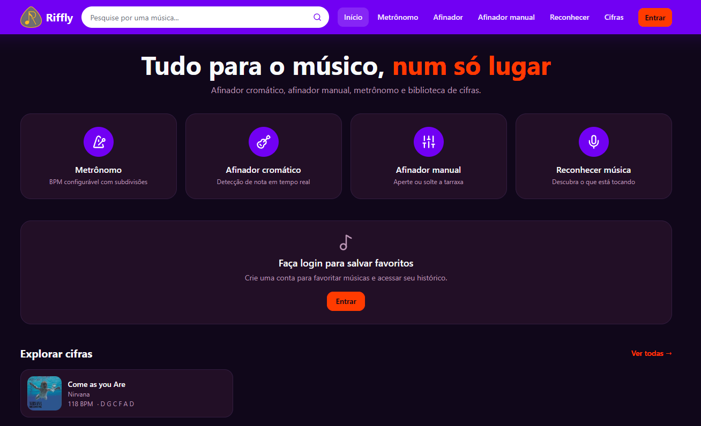 | 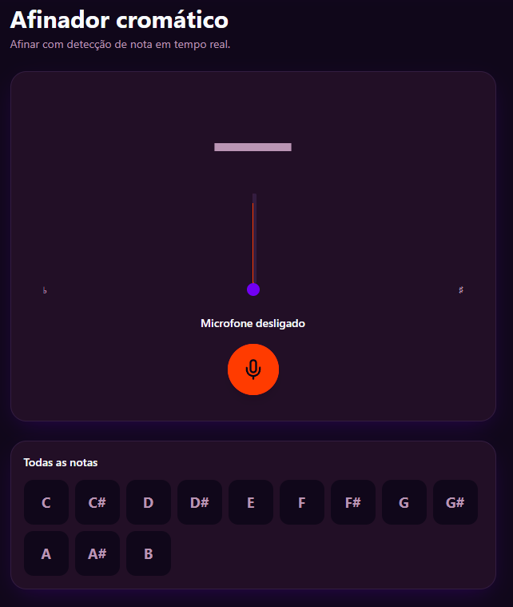 |

| Manual tuner | Metronome |
|---|---|
| 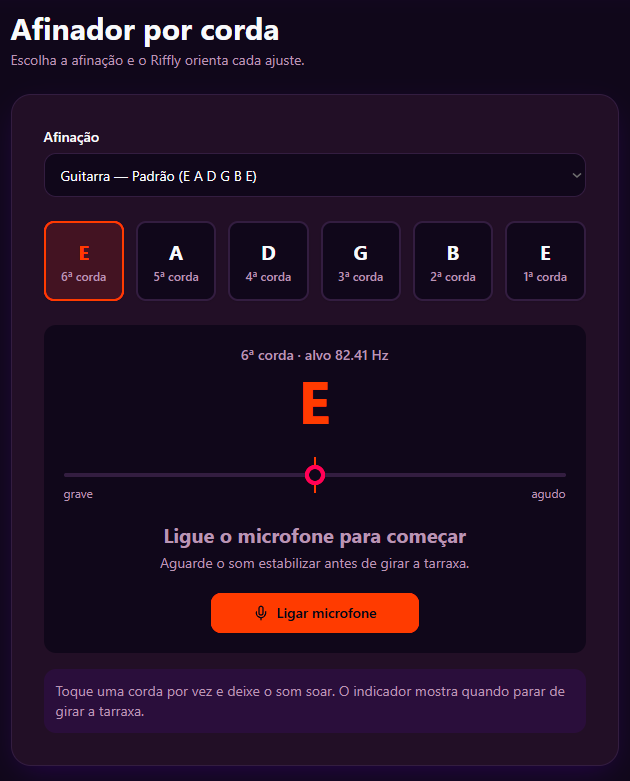 | 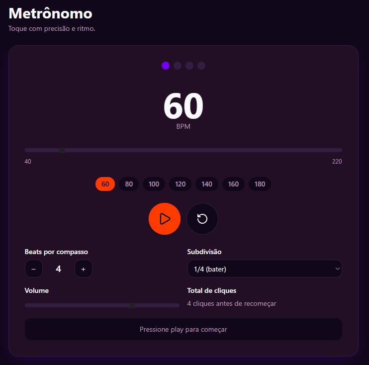 |

| Chord sheet | Song recognition |
|---|---|
| 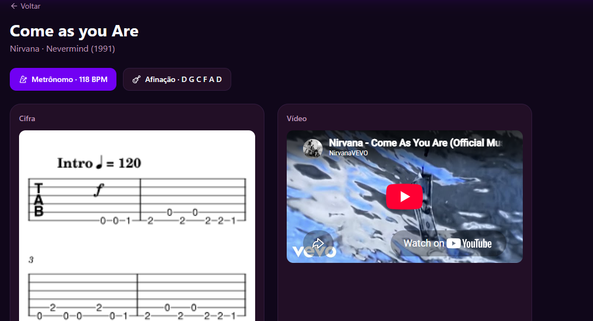 | 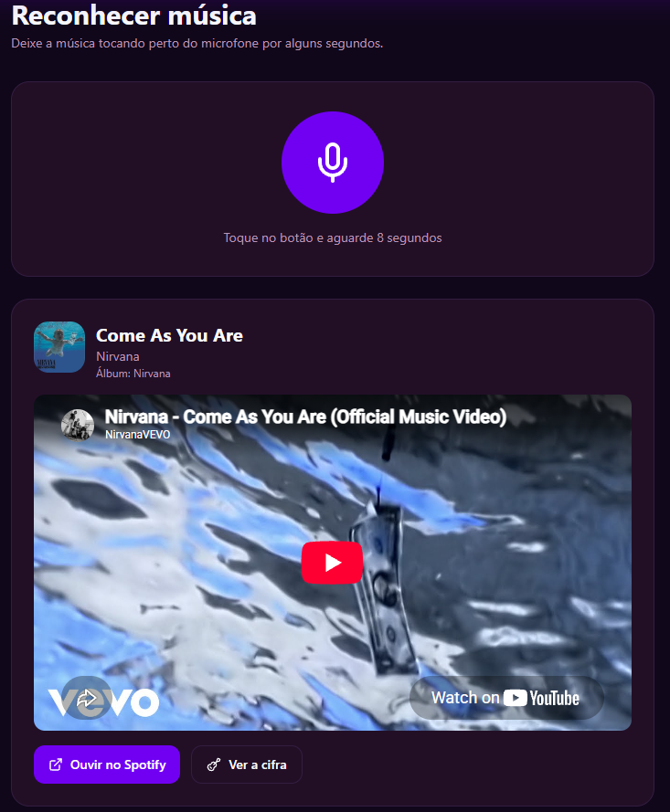 |

| Sign in | Register |
|---|---|
| 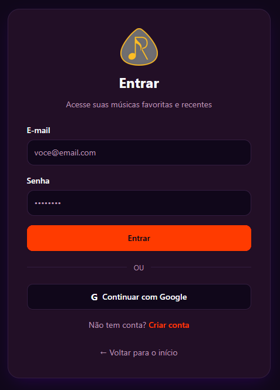 | 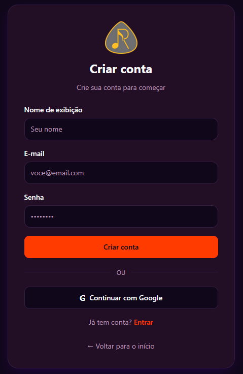 |

| Admin panel | Add chord sheet |
|---|---|
| 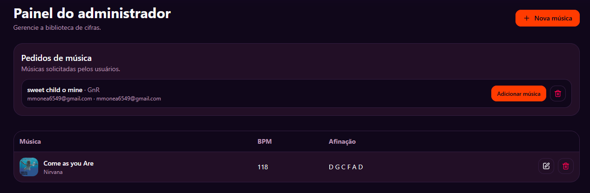 | 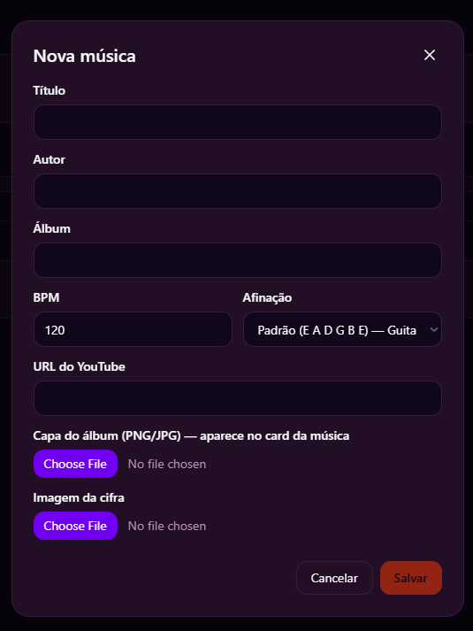 |

| Owner panel | Add admin |
|---|---|
| 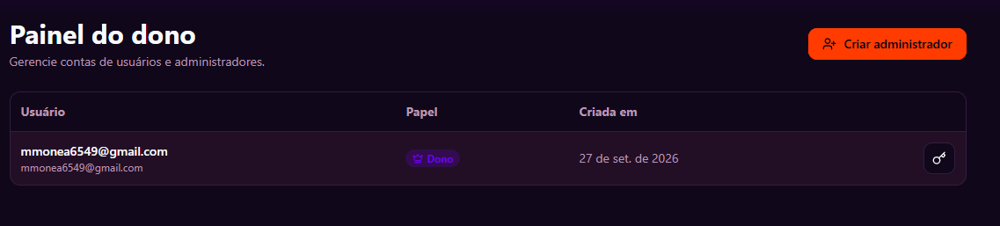 | 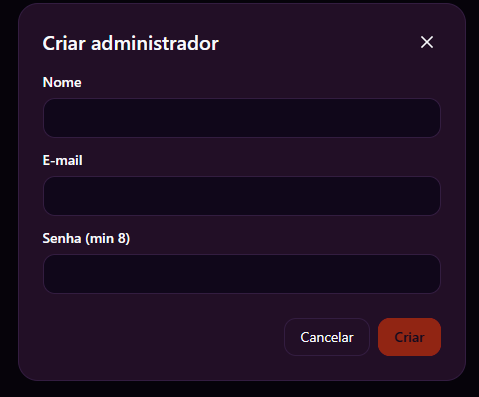 |

## Tech stack

| Layer | Technology |
|---|---|
| UI | React 19 + Tailwind CSS 4 + shadcn/ui components |
| Routing & SSR | TanStack Router + TanStack Start |
| Build tool | Vite 8 |
| Server build target | Nitro (production builds only — see note below) |
| Backend / data | Supabase (Postgres, Auth, Storage) |
| Validation | Zod |
| Package manager & runtime | Bun |
| Third-party API | ACRCloud (audio recognition) |

## Getting started

### Prerequisites

- [Bun](https://bun.sh)
- A [Supabase](https://supabase.com) project (Postgres + Auth + Storage)
- An [ACRCloud](https://www.acrcloud.com) project (Audio & Video Recognition), for the song-recognition feature

### Setup

```sh
bun install
```

Copy `.env.example` (or create `.env`) with the following variables:

```env
SUPABASE_PROJECT_ID=
SUPABASE_URL=
SUPABASE_PUBLISHABLE_KEY=
SUPABASE_SERVICE_ROLE_KEY=

VITE_SUPABASE_PROJECT_ID=
VITE_SUPABASE_URL=
VITE_SUPABASE_PUBLISHABLE_KEY=

ACRCLOUD_HOST=
ACRCLOUD_ACCESS_KEY=
ACRCLOUD_ACCESS_SECRET=
```

`SUPABASE_SERVICE_ROLE_KEY` and the `ACRCLOUD_*` variables are server-only secrets — never prefix them with `VITE_`, or they'd be exposed to the browser.

### Database

Run the SQL migrations in `supabase/migrations/` against your Supabase project (via the SQL Editor or the Supabase CLI), then create a `chord-images` storage bucket (public read access) for chord sheet and cover images.

### Google sign-in (optional)

Configure a Google OAuth client in [Google Cloud Console](https://console.cloud.google.com) and add the Client ID/Secret under **Authentication → Providers → Google** in your Supabase project. No `.env` changes are needed for this — Supabase handles the OAuth flow itself.

### Run locally

```sh
bun dev
```

The app runs at `http://localhost:3000`.

### Build for production

```sh
bun run build
```

## Deployment

The app can be deployed to any host that supports Nitro's server output (e.g. Vercel, Netlify, Cloudflare, or a Node server) — Supabase remains an external service regardless of where the app itself is hosted. Set the same environment variables listed above in your hosting provider's dashboard.

## License

All rights reserved. This repository is shared for portfolio and academic
evaluation purposes only — no permission is granted to use, copy, modify,
or distribute this code. See [LICENSE](./LICENSE) for the full notice.

## 👨‍💻 Developer

**Marcos P. Monea**
Information Technology student and developer of the Riffly project.

[GitHub](https://github.com/marcospmtech) · [E-mail](mailto:marcos.monea@yahoo.com) · [Instagram](https://www.instagram.com/marcosmonea.bjj/)
